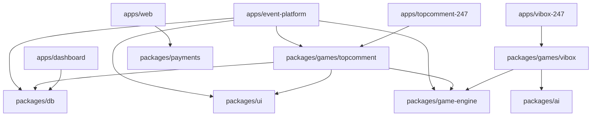

# Social.gg - Interactive Bar & Venue Games Platform

A **fully modular Turborepo monorepo** for interactive social games, built with Supabase, React, and TypeScript.

## 🎯 Architecture

This monorepo uses a **plugin-based game engine** where games are self-contained modules that can be:
- Combined in multi-game events
- Deployed standalone for 24/7 mode
- Shared across Event Mode and Patron Mode

### Apps

```
apps/
├── event-platform/     # Universal event host (combines any games)
├── topcomment-247/     # Top Comment 24/7 (Facebook wall)
├── vibox-247/          # VIBox 24/7 (AI jukebox)
├── web/                # Landing page + admin panel
└── dashboard/          # Venue analytics dashboard
```

### Packages

```
packages/
├── game-engine/        # Core orchestration + plugin system
├── games/
│   ├── topcomment/     # Top Comment game (Event + Patron modes)
│   └── vibox/          # VIBox game (Event + Patron modes)
├── ui/                 # Shared React components
├── db/                 # Supabase client + queries
├── ai/                 # OpenAI moderation + Suno music
└── payments/           # Helcim + Stripe integrations
```

## 🚀 Quick Start

### Prerequisites

- Node.js 20+
- pnpm 10+

### Installation

```bash
# Install dependencies
pnpm install

# Start all apps in development
pnpm dev

# Build all apps
pnpm build

# Run linting
pnpm lint

# Type check all packages
pnpm type-check
```

### Running Individual Apps

```bash
# Event platform only
pnpm --filter @social/event-platform dev

# Top Comment 24/7 only
pnpm --filter @social/topcomment-247 dev

# Web landing page only
pnpm --filter @social/web dev
```

## 🎮 Games

### Top Comment
**Twitter-parody comedy game**

- **Event Mode**: Host-controlled rounds with live voting
- **24/7 Mode**: Facebook-style wall for continuous play
- **Features**: AI moderation, leaderboards, presenter view

### VIBox (Coming Soon)
**AI-powered jukebox**

- **Event Mode**: Crowd-sourced music selection
- **24/7 Mode**: Patron-requested songs via Suno AI
- **Features**: Payment integration, queue management

## 🏗️ Tech Stack

- **Frontend**: React 18, Vite, TailwindCSS, TypeScript
- **Backend**: Supabase (PostgreSQL + Realtime + Auth)
- **Deployment**: Vercel (frontend), Supabase Edge Functions (backend)
- **Monorepo**: Turborepo + pnpm workspaces
- **AI**: OpenAI (moderation), Suno (music generation)
- **Payments**: Stripe (subscriptions), Helcim (payment links)

## 📦 Package Dependencies



## 🗄️ Database

Supabase PostgreSQL with:
- **Tables**: sessions, players, submissions, votes, venues, event_rounds
- **RLS**: Row Level Security for multi-tenancy
- **Realtime**: Live game state synchronization
- **Types**: Auto-generated TypeScript types

See `supabase/migrations/` for schema.

## 🚢 Deployment

Each app deploys independently to Vercel:

1. **social.gg** → `apps/web`
2. **events.social.gg** → `apps/event-platform`
3. **topcomment.social.gg** → `apps/topcomment-247`
4. **vibox.social.gg** → `apps/vibox-247`
5. **dashboard.social.gg** → `apps/dashboard`

See [VERCEL_DEPLOYMENT.md](./VERCEL_DEPLOYMENT.md) for details.

## 📚 Documentation

- [Migration Status](./MIGRATION_STATUS.md) - Current migration progress
- [Backend Migration](./BACKEND_MIGRATION.md) - Firebase → Supabase guide
- [Vercel Deployment](./VERCEL_DEPLOYMENT.md) - Deployment instructions
- [Game Engine](./GAME_ENGINE.md) - Original game engine design (Firebase)
- [Tech Architecture](./docs/04-tech-architecture.md) - Planned architecture

## 🔧 Development

### Adding a New Game

1. Create `packages/games/newgame/`
2. Implement `EventMode.ts` and `PatronMode.ts`
3. Export `GamePluginDefinition`
4. Register in `GameRegistry`
5. Create standalone app in `apps/newgame-247/` (optional)

### Project Structure

```
social/
├── apps/               # Deployable applications
├── packages/           # Shared code
├── supabase/           # Database migrations
├── turbo.json          # Turborepo config
├── pnpm-workspace.yaml # Workspace definition
└── package.json        # Root package
```

## 📝 Scripts

```bash
# Development
pnpm dev                 # Start all apps
pnpm build               # Build all apps
pnpm lint                # Lint all packages
pnpm type-check          # Type check all packages
pnpm test                # Run all tests

# Turborepo
pnpm turbo run build     # Build with caching
pnpm turbo run dev --parallel  # Run all in parallel

# Supabase
supabase start           # Start local Supabase
supabase db push         # Push migrations
supabase gen types typescript --local > supabase/types.ts
```

## 🎯 Modularity Benefits

- ✅ **Add games without touching platform code**
- ✅ **Events can combine multiple games** (TC → VIBox → TC)
- ✅ **Shared logic** between Event and 24/7 modes
- ✅ **Independent deployments** for each app
- ✅ **Type-safe** across the entire stack

## 📄 License

Proprietary - All rights reserved

## 👥 Team

Social.gg - Interactive games for bars and venues
