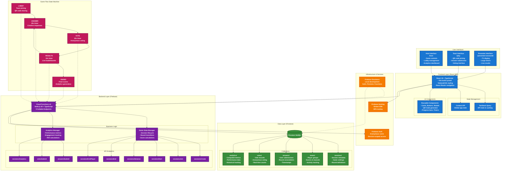

```mermaid
graph TB
    %% User Interfaces
    subgraph "User Interfaces"
        HI[Host Interface<br/>/host<br/>- Game controls<br/>- Lobby management<br/>- Analytics dashboard]
        TI[Team Interface<br/>/play<br/>- QR code joining<br/>- Answer submission<br/>- Voting interface]
        PI[Presenter Interface<br/>/presenter/:sessionId<br/>- TV display<br/>- Large timers<br/>- Live results]
    end

    %% Frontend Layer
    subgraph "Frontend Layer (React SPA)"
        direction TB
        React[React 19 + TypeScript<br/>- Vite build system<br/>- TailwindCSS styling<br/>- React Router navigation]
        
        subgraph "State Management"
            RQ[TanStack Query<br/>API state & caching]
            Context[Context API<br/>Global app state]
        end
        
        subgraph "UI Components"
            Components[Reusable Components<br/>- Cards, Buttons, Modals<br/>- QR Code generator<br/>- Progress bars, Timers]
        end
    end

    %% Backend Layer
    subgraph "Backend Layer (Firebase)"
        direction TB
        CF[Cloud Functions v2<br/>Node.js 20 + TypeScript<br/>9 Callable Endpoints]
        
        subgraph "Business Logic"
            GSM[Game State Manager<br/>- Session lifecycle<br/>- Round transitions<br/>- Score calculations]
            AM[Analytics Manager<br/>- Performance metrics<br/>- Engagement tracking<br/>- ROI calculations]
        end
        
        subgraph "API Endpoints"
            direction LR
            SC[sessionsCreate]
            SJ[sessionsJoin]
            SS[sessionsStart]
            SA[sessionsAdvance]
            AS[answersSubmit]
            VS[votesSubmit]
            SE[sessionsEnd]
            SK[sessionsKickPlayer]
            SA2[sessionsAnalytics]
        end
    end

    %% Data Layer
    subgraph "Data Layer (Firestore)"
        direction TB
        FS[(Firestore NoSQL)]
        
        subgraph "Collections"
            Sessions[sessions/<br/>- Session metadata<br/>- Game settings<br/>- Round definitions]
            Teams[teams/<br/>- Player groups<br/>- Scores & mascots<br/>- Activity tracking]
            Answers[answers/<br/>- User submissions<br/>- Round associations<br/>- Timestamps]
            Votes[votes/<br/>- Vote records<br/>- Anonymous voting<br/>- Real-time counts]
            Analytics[analytics/<br/>- Computed metrics<br/>- Performance data<br/>- Historical tracking]
        end
    end

    %% Infrastructure
    subgraph "Infrastructure & Services"
        direction TB
        Hosting[Firebase Hosting<br/>Global CDN<br/>SPA routing]
        Auth[Firebase Auth<br/>Anonymous users<br/>Session-scoped access]
        Emulators[Firebase Emulators<br/>Local development<br/>Auth, Firestore, Functions]
    end

    %% Game Flow
    subgraph "Game Flow State Machine"
        direction LR
        Lobby[LOBBY<br/>Team joining<br/>QR code sharing] --> Answer[ANSWER<br/>45s timer<br/>Creative responses]
        Answer --> Vote[VOTE<br/>25s timer<br/>Anonymous voting]
        Vote --> Results[RESULTS<br/>10s timer<br/>Live leaderboards]
        Results --> Answer
        Results --> Ended[ENDED<br/>Final scores<br/>Analytics generation]
    end

    %% Connections
    HI --> React
    TI --> React
    PI --> React
    
    React --> RQ
    React --> Context
    React --> Components
    
    React --> CF
    CF --> GSM
    CF --> AM
    
    GSM --> SC
    GSM --> SJ
    GSM --> SS
    GSM --> SA
    GSM --> SE
    GSM --> SK
    
    AM --> AS
    AM --> VS
    AM --> SA2
    
    CF --> FS
    FS --> Sessions
    FS --> Teams
    FS --> Answers
    FS --> Votes
    FS --> Analytics
    
    CF --> Auth
    React --> Hosting
    Emulators -.-> CF
    Emulators -.-> FS
    
    Lobby -.-> CF
    Answer -.-> CF
    Vote -.-> CF
    Results -.-> CF
    Ended -.-> CF

    %% Styling
    classDef frontend fill:#1976d2,stroke:#0d47a1,stroke-width:3px,color:#ffffff,font-weight:bold
    classDef backend fill:#7b1fa2,stroke:#4a148c,stroke-width:3px,color:#ffffff,font-weight:bold
    classDef data fill:#388e3c,stroke:#1b5e20,stroke-width:3px,color:#ffffff,font-weight:bold
    classDef infra fill:#f57c00,stroke:#e65100,stroke-width:3px,color:#ffffff,font-weight:bold
    classDef flow fill:#c2185b,stroke:#880e4f,stroke-width:3px,color:#ffffff,font-weight:bold
    
    class React,HI,TI,PI,RQ,Context,Components frontend
    class CF,GSM,AM,SC,SJ,SS,SA,AS,VS,SE,SK,SA2 backend
    class FS,Sessions,Teams,Answers,Votes,Analytics data
    class Hosting,Auth,Emulators infra
    class Lobby,Answer,Vote,Results,Ended flow
```